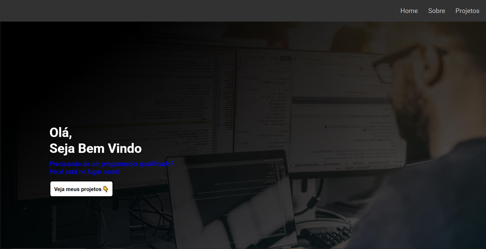
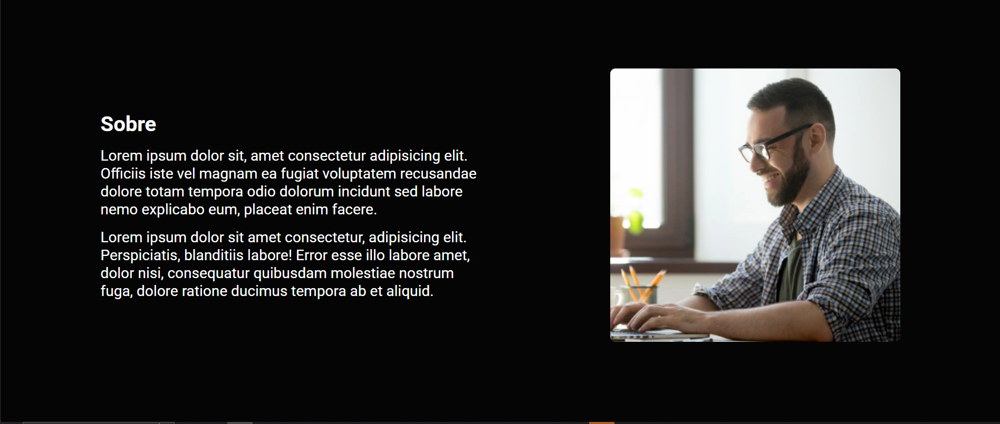
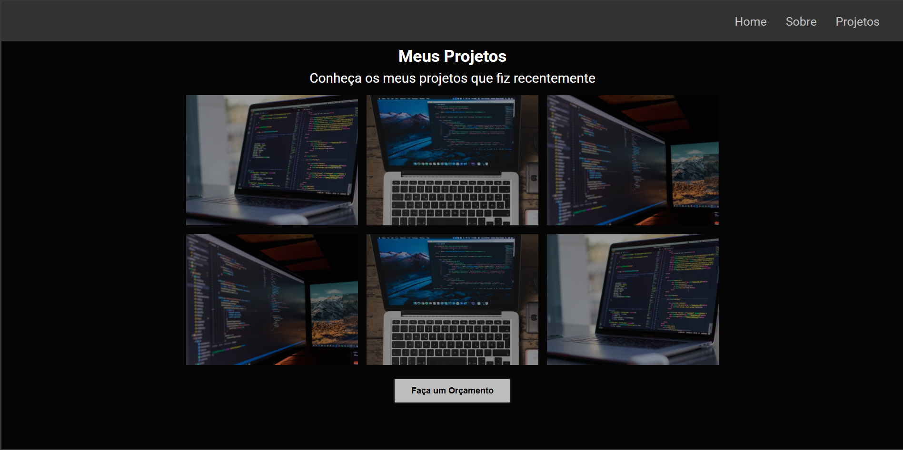

# 🧑‍💻Portfólio

## 📖 Sobre:

Esse é o meu primeiro projeto, criado com o objetivo de praticar HTML e CSS.  
Desenvolvi um portfólio simples e responsivo.

## 🚀 Tecnologias utilizadas

- **HTML5**
- **CSS3**

## 🎯 Objetivo

praticar os fundamentos de estruturação de páginas com HTML e estilização com CSS.

## 💡 O que aprendi

- Criar uma página HTML semântica e organizada.
- Usar `flexbox` para alinhar elementos.
- Aplicar efeitos de `hover` e transições suaves.
- Trabalhar com fontes do Google Fonts.
- Criar um layout responsivo.

## 🖼️ Prévia do projeto

---

📅 Projeto criado para estudos e prática pessoal
